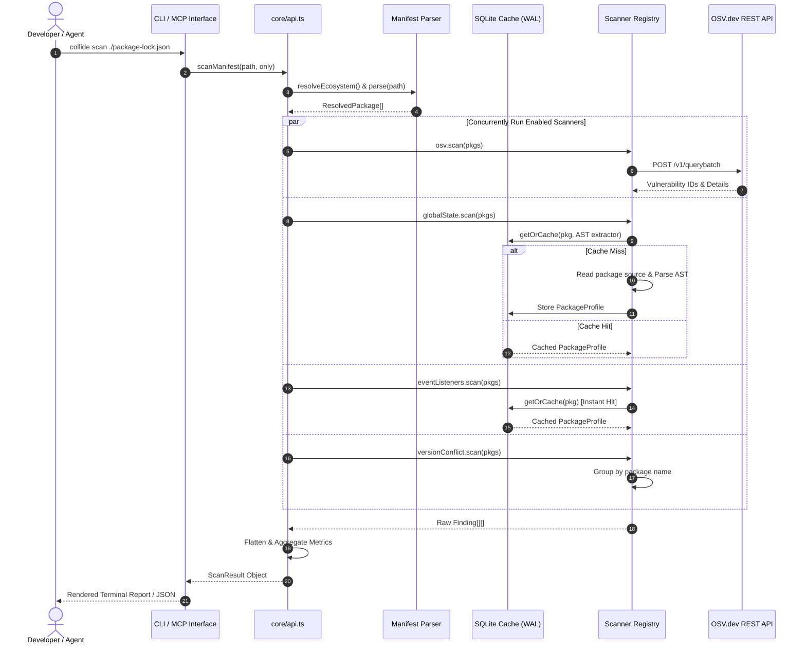

# Collide (`dep-collide`) — Comprehensive Codebase & Interview Guide

> **Tagline:** Multi-ecosystem dependency-collision & vulnerability scanner (npm, Go, Python, Rust, PHP) shipping as both a high-performance CLI tool and a Model Context Protocol (MCP) server for AI agents.

---

## 📑 Table of Contents
1. [Executive Summary & Problem Statement](#1-executive-summary--problem-statement)
2. [High-Level Architecture & Core Principles](#2-high-level-architecture--core-principles)
3. [Technology Stack & Key Dependencies](#3-technology-stack--key-dependencies)
4. [Ecosystem Support & Analysis Mechanisms](#4-ecosystem-support--analysis-mechanisms)
5. [Deep Dive: The 4 Core Scanner Modules](#5-deep-dive-the-4-core-scanner-modules)
6. [Data Flow & Execution Lifecycle](#6-data-flow--execution-lifecycle)
7. [MCP (Model Context Protocol) Integration](#7-mcp-model-context-protocol-integration)
8. [Performance & Caching Strategy (SQLite + WAL)](#8-performance--caching-strategy-sqlite--wal)
9. [Directory Structure & Module Breakdown](#9-directory-structure--module-breakdown)
10. [Interview Preparation Guide (System Design & Behavioral Q&A)](#10-interview-preparation-guide-system-design--behavioral-qa)

---

## 1. Executive Summary & Problem Statement

### The Problem
Modern applications depend on hundreds or thousands of third-party open-source packages across multiple language ecosystems (JavaScript/npm, Python/PyPI, Go modules, Rust/crates.io, PHP/Composer).

Traditional software composition analysis (SCA) tools (e.g., `npm audit`, Snyk, Dependabot) only address **known published vulnerabilities (CVEs/GHSAs)**. However, modern dependency trees suffer from two other critical classes of supply-chain issues:
1. **Hidden Runtime Collisions / Side-Effect Clobbering:** Multiple independent libraries attempting to mutate the exact same global runtime state (e.g., JavaScript prototypes, global singleton configurations, environment variables) or competing to register process-wide event handlers and signals (e.g., `window:resize`, `process.on('SIGTERM')`, `sys.excepthook`, `atexit`). The last-loaded library silently overwrites the others, resulting in non-deterministic bugs or security bypasses.
2. **Diamond Dependency Version Conflicts:** Conflicting versions of the same transitive library loaded into the runtime graph, leading to state duplication, memory bloat, and subtle type-checking failures.

### The Solution: Collide
**Collide** is an extensible, single-binary CLI and MCP server that bridges static security analysis and supply-chain collision detection across **5 language ecosystems**:
- **Scans Known Vulnerabilities:** Queries Google's OSV (Open Source Vulnerabilities) API in batched requests.
- **Scans State Collisions:** Performs AST walks (JavaScript) and syntax heuristics (Python, Go, Rust, PHP) over installed source packages.
- **Scans Event Listener Collisions:** Flags competing process-level hooks, signals, and event listeners.
- **Scans Version Conflicts:** Resolves lockfiles and dependency trees to detect duplicate version resolution.
- **Dual Interfaces:** Provides an interactive rich terminal interface for developers and an MCP tool interface (`collide-mcp`) for LLM agents (Claude Code, Cursor, Claude Desktop).

---

## 2. High-Level Architecture & Core Principles

```
                              ┌─────────────────────────────────────────┐
                              │               User / Agent              │
                              └────────────────────┬────────────────────┘
                                                   │
                         ┌─────────────────────────┴─────────────────────────┐
                         ▼                                                   ▼
                CLI (`cli.ts`)                                    MCP Server (`mcp.ts`)
             Interactive Terminal UI                             JSON-RPC via Stdio
                         │                                                   │
                         └─────────────────────────┬─────────────────────────┘
                                                   │
                                                   ▼
                                     Core API Engine (`core/api.ts`)
                                                   │
                                     Ecosystem Detection & Dispatch
                         ┌─────────────┬───────────┼───────────┬─────────────┐
                         ▼             ▼           ▼           ▼             ▼
                        npm           Go        Python       Rust           PHP
                   package-lock     go.sum    requirements  Cargo.lock  composer.lock
                         │             │           │           │             │
                         └─────────────┼───────────┼───────────┼─────────────┘
                                       │
                                       ▼
                       ResolvedPackage[] Normalization
                                       │
                                       ▼
                      Orchestrator (`core/scanner.ts`)
                        Promise.all Concurrent Fan-Out
            ┌──────────────────┬───────────────────┬───────────────────┐
            ▼                  ▼                   ▼                   ▼
      OSV Scanner        Global State        Event Listeners    Version Conflict
     (Network Batch)    (AST / Heuristic)   (AST / Heuristic)   (Pure Lockfile)
            │                  │                   │                   │
            │                  └─────────┬─────────┘                   │
            │                            │                             │
            │                    SQLite WAL Cache                      │
            │                    (`cache/db.ts`)                       │
            │                            │                             │
            └──────────────────┬─────────┴─────────────────────────────┘
                               ▼
                        Flattened Findings[]
                               │
            ┌──────────────────┴──────────────────┐
            ▼                                     ▼
     Rich Terminal Report                  Structured JSON /
   (Cards, Bars, Badges)                   MCP Tool Response
```

### Architectural Principles
1. **Pluggable Scanner Interface:** Every scanner module implements the identical TypeScript `Scanner` contract. Adding a new scanner requires creating one file and adding one entry to the ecosystem registry—zero modifications to the core orchestrator.
2. **Single Merge Point:** `runScans()` concurrently runs all enabled scanners, manages lifecycle hooks (`onStart`, `onDone`, `onError`), isolates errors so a failing scanner cannot crash the pipeline, and flattens `Finding[]` results.
3. **Shared Profile Extraction:** Scanners that inspect package source (e.g. `global-state` and `event-listeners`) share the same source walk and SQLite cache. The walk runs **once per package**, extracting multiple buckets (`writes`, `listeners`) simultaneously.
4. **Headless Engine Separation:** `core/api.ts` is purely functional data processing with no I/O side effects, enabling identical scan results across both CLI and MCP channels.

---

## 3. Technology Stack & Key Dependencies

| Component | Technology | Purpose & Rationale |
|---|---|---|
| **Runtime & Language** | **Node.js (≥18) + TypeScript 5.4** | Modern ESM-first codebase, strong typing across scanner contracts, native `fetch` and `AbortController`. |
| **AST Parser & Traversal** | **`@babel/parser` & `@babel/traverse`** | Robust parsing of modern JavaScript, JSX, and TypeScript ASTs with error recovery mode for npm packages. |
| **Embedded Database** | **`better-sqlite3` (with WAL mode)** | High-performance synchronous SQLite wrapper for local caching of AST profiles keyed by `name@version`. |
| **Agent Protocol** | **`@modelcontextprotocol/sdk`** | Standardized MCP server implementation over `stdio` transport for Claude, Cursor, and other AI agents. |
| **Schema Validation** | **`zod`** | Strict runtime input validation for CLI flags and MCP tool input schemas. |
| **Build System & Runner** | **`tsup` (esbuild) & `tsx`** | Blazing-fast TypeScript bundler generating standalone dual CJS/ESM binaries (`collide` and `collide-mcp`). |
| **Test Runner** | **Node.js Native Test Runner (`node:test`)** | Zero-dependency, native parallel test runner for unit tests and synthetic multi-ecosystem vulnerability fixtures. |

---

## 4. Ecosystem Support & Analysis Mechanisms

Collide automatically detects the ecosystem based on the manifest filename:

| Ecosystem | Detected Manifest Files | Source Location Mechanism | Static Extraction Strategy |
|---|---|---|---|
| **npm** | `package-lock.json` (v1, v2, v3) | Relative `node_modules` directory lookup | **True AST Parse & Walk** via Babel (`AssignmentExpression`, `MemberExpression`, `CallExpression`) |
| **Python** | `requirements.txt`, `poetry.lock`, `Pipfile.lock` | Virtual environment discovery (`.venv`, `venv` beside manifest) | **Heuristic Regex Extractor** over `.py` files in `site-packages` (PEP 503 name normalization) |
| **Go** | `go.sum`, `go.mod` | Go module cache (`$GOMODCACHE` or `~/go/pkg/mod`) | **Heuristic Regex Extractor** over `.go` files; Go major-version path conflict detection (`/v2`, `/v3`) |
| **Rust** | `Cargo.lock` | Cargo registry cache (`~/.cargo/registry/src` or `$COLLIDE_CARGO_SRC`) | **Heuristic Regex Extractor** over `.rs` crate source files |
| **PHP** | `composer.lock` | Composer vendor directory (`vendor/<vendor>/<package>/`) | **Heuristic Regex Extractor** with namespace tracking (`namespace` reset on `<?php`) |

---

## 5. Deep Dive: The 4 Core Scanner Modules

### 1. `osv` Scanner (Network Vulnerability Scanner)
- **Goal:** Identify known vulnerabilities across CVE, GHSA, and RustSec databases.
- **Mechanism:**
  1. Sends a single batched `POST` request to `https://api.osv.dev/v1/querybatch` with all resolved package names and versions.
  2. Deduplicates resulting vulnerability IDs across packages to minimize network roundtrips.
  3. Concurrently fetches specific vulnerability details from `/v1/vulns/{id}`.
  4. Maps OSV database severities (or parses numeric CVSS scores) into a normalized `low | medium | high` scale.
  5. Includes a 15-second `AbortController` timeout and graceful offline fallback (logs a warning, emits empty findings without throwing).

### 2. `global-state` Scanner (Prototype & Global Mutation)
- **Goal:** Detect instances where two or more independent packages write to the same global object, prototype, or process environment.
- **What it detects:**
  - **JS/npm:** Built-in prototype modifications (`Array.prototype.flat = ...`, `Object.defineProperty(String.prototype, ...)`), global writes (`window.foo = ...`, `globalThis.bar = ...`).
  - **Python:** `os.environ["KEY"]` writes, `sys.modules["json"]` replacement, stdlib monkeypatching (`socket.socket = ...`, `gevent.monkey.patch_all()`).
  - **Go:** Duplicate CLI flags (`flag.String("port", ...)`), duplicate HTTP routes (`http.HandleFunc("/metrics", ...)`), duplicate `expvar` names, Prometheus default registry collisions.
  - **Rust:** Multiple `#[global_allocator]` or `#[panic_handler]` definitions, competing `env::set_var("KEY", ...)` calls.
  - **PHP:** Root-namespace global function redeclarations (`function dump()`), duplicate `define("CONST", ...)` constants, `$GLOBALS` superglobal mutations, `ini_set()` modifications.
- **Collision Rule:** Flags any target whose owner count is $\ge 2$.

### 3. `event-listeners` / `hooks` Scanner (Lifecycle & Signal Contention)
- **Goal:** Detect competing process-level hook registrations or signal handlers.
- **What it detects:**
  - **JS/npm:** Multiple libraries binding to `window.addEventListener("resize", ...)` or `process.on("SIGTERM", ...)`.
  - **Python:** Multiple libraries setting `signal.signal(SIGTERM, ...)`, `atexit.register(...)`, `sys.excepthook`, or `sys.addaudithook`.
  - **Go:** Competing `signal.Notify(ch, syscall.SIGTERM)` or `runtime.SetFinalizer`.
  - **Rust:** Competing `panic::set_hook(...)`, `log::set_logger(...)`, `tracing::subscriber::set_global_default(...)`, or `signal_hook::register(...)`.
  - **PHP:** Competing `set_error_handler()`, `register_shutdown_function()`, `spl_autoload_register()`, `pcntl_signal()`.
- **Collision Rule:** Grouped by target; flags targets registered by $\ge 2$ independent packages.

### 4. `version-conflict` Scanner (Duplicate Version Detection)
- **Goal:** Flag dependencies that appear at multiple distinct versions in the dependency tree.
- **Mechanism:**
  - Operates purely on the parsed `ResolvedPackage[]` without touching disk or network.
  - Groups packages by name (or canonicalized module name for Go).
  - Flags any package where `Set(versions).size > 1`.
  - Special Go logic: Handles major-version module paths (e.g., `github.com/foo/bar` vs `github.com/foo/bar/v2`) as a single conflict group.

---

## 6. Data Flow & Execution Lifecycle



---

## 7. MCP (Model Context Protocol) Integration

Collide implements a standards-compliant MCP server ([`src/mcp.ts`](file:///Users/sujan/Documents/Projects/PES-2/CLI-PES/collide/src/mcp.ts)) using `@modelcontextprotocol/sdk`.

### Tool Specification: `scan_dependencies`
```json
{
  "name": "scan_dependencies",
  "description": "Scan a dependency manifest/lockfile for known vulnerabilities (OSV), duplicate/conflicting versions, global-state writes, and event-listener collisions.",
  "inputSchema": {
    "type": "object",
    "properties": {
      "manifestPath": {
        "type": "string",
        "description": "Path to the lockfile/manifest (e.g., ./package-lock.json, ./go.sum, ./requirements.txt, ./Cargo.lock, ./composer.lock)"
      },
      "only": {
        "type": "array",
        "items": { "type": "string" },
        "description": "Optional subset of scanners: ['osv', 'global-state', 'event-listeners', 'version-conflict']"
      }
    },
    "required": ["manifestPath"]
  }
}
```

### Key MCP Design Decisions
- **Stdio Transport:** Communicates via standard input/output (`StdioServerTransport`).
- **Clean Stderr Logging:** All diagnostic logs, warnings, and startup banners write strictly to `stderr` so that `stdout` remains pristine JSON-RPC.
- **Structured Error Handling:** Missing lockfiles or scanner faults return `{ isError: true, content: [...] }` without terminating the daemon process.

---

## 8. Performance & Caching Strategy (SQLite + WAL)

AST parsing is CPU-intensive. Because open-source package versions are immutable on disk, Collide uses an embedded SQLite database (`better-sqlite3`) to achieve high throughput:
1. **Cache Keying:** Keyed strictly by `package_name@version` (e.g., `lodash@4.17.21`).
2. **Write-Ahead Logging (WAL Mode):** Enabled via `PRAGMA journal_mode = WAL;`, allowing concurrent reads and fast append writes.
3. **Prepared Statements:** Uses pre-compiled `SELECT` and `INSERT OR REPLACE` statements.
4. **Cross-Scanner Cache Sharing:** The `global-state` scanner and `event-listeners` scanner both read from the same `PackageProfile` row, eliminating redundant AST walks.

---

## 9. Directory Structure & Module Breakdown

```
collide/
├── package.json                    # Project configuration, scripts, binaries
├── tsup.config.ts                  # Bundler configuration for cli.ts and mcp.ts
├── src/
│   ├── cli.ts                      # CLI entry point, argument parsing, terminal output
│   ├── mcp.ts                      # MCP server entry point for LLM agents
│   ├── core/
│   │   ├── types.ts                # Core contracts (Scanner, Finding, ResolvedPackage)
│   │   ├── api.ts                  # Central scanner engine & ecosystem resolver
│   │   ├── scanner.ts              # Concurrent scanner runner & hook manager
│   │   ├── lockfile.ts             # npm package-lock.json parser
│   │   ├── pip-manifest.ts         # Python requirements.txt/poetry.lock/Pipfile parser
│   │   ├── go-manifest.ts          # Go go.sum / go.mod parser
│   │   ├── cargo-manifest.ts       # Rust Cargo.lock parser
│   │   └── composer-manifest.ts    # PHP composer.lock parser
│   ├── scanners/
│   │   ├── osv.ts                  # Network OSV.dev vulnerability scanner
│   │   ├── shared-ast-extractor.ts # Babel JS AST extractor (writes & listeners)
│   │   ├── global-state.ts         # npm global & prototype collision scanner
│   │   ├── event-listeners.ts      # npm event listener collision scanner
│   │   ├── version-conflict.ts     # General version conflict scanner
│   │   ├── go-collision.ts         # Go global state & listener scanners
│   │   ├── go-profile-extractor.ts # Go heuristic source extractor
│   │   ├── py-collision.ts         # Python global state & hook scanners
│   │   ├── py-profile-extractor.ts # Python heuristic source extractor
│   │   ├── rust-collision.ts       # Rust allocator/panic/logger scanners
│   │   ├── rust-profile-extractor.ts# Rust heuristic source extractor
│   │   ├── php-collision.ts        # PHP function redeclaration & hook scanners
│   │   ├── php-profile-extractor.ts# PHP heuristic source extractor
│   │   ├── source-locator.ts       # File system locator for package source files
│   │   └── util.ts                 # Grouping and target aggregation utilities
│   ├── cache/
│   │   └── db.ts                   # SQLite WAL caching layer for AST profiles
│   └── report/
│       ├── ui.ts                   # ANSI formatting, boxes, gradients, progress bars
│       └── format.ts               # Terminal report renderer & JSON formatter
└── test/                           # Unit tests & synthetic vulnerability labs
```

---

## 10. Interview Preparation Guide (System Design & Behavioral Q&A)

### Q1: How would you explain Collide in 60 seconds to an interviewer?
> **Answer:**
> *"Collide is a multi-ecosystem dependency scanner that finds not just known CVEs, but also runtime supply-chain collisions and diamond dependency version conflicts across npm, Python, Go, Rust, and PHP projects. Traditional scanners only check vulnerability databases like OSV. Collide goes further: it parses dependency trees, walks package source code using Babel ASTs and regex heuristics, and identifies instances where two independent libraries fight over the same global objects, prototypes, signal handlers, or environment variables. It is architected with a pluggable scanner interface, caches immutable AST profiles in SQLite with WAL mode, and exposes both a rich terminal CLI and an MCP server for AI agent workflows."*

---

### Q2: What were the key architectural tradeoffs between full AST parsing vs. heuristic regex scanning?
> **Answer:**
> - **JavaScript / npm:** JavaScript runs in the Node.js host environment. Babel (`@babel/parser` and `@babel/traverse`) is readily available in the Node runtime, fast, and provides 100% syntactic precision (distinguishing between assignment, declaration, member expression, and local scoping).
> - **Other Ecosystems (Python, Go, Rust, PHP):** Embedding full native compilers or tree-sitter WASM grammars for 4 additional languages in a lightweight npm package would bloat the binary, introduce native binding compilation headaches, and increase scan startup latency.
> - **The Decision:** High-value collision patterns (e.g. `signal.signal()`, `#[global_allocator]`, `http.HandleFunc`, `os.environ[...]`) are syntactically distinct. Collide strips comments and docstrings first, then executes targeted regex extractors. This provides 90%+ signal accuracy at near-zero overhead without external language runtime dependencies.

---

### Q3: How does Collide handle concurrency and fault isolation when executing scans?
> **Answer:**
> - In `core/scanner.ts`, the orchestrator executes scanners concurrently using `Promise.all(enabled.map(...))`.
> - Each scanner execution is wrapped in its own `try/catch` block with lifecycle hooks (`onStart`, `onDone`, `onError`).
> - If an external dependency fails (such as OSV network failure or an unparseable malformed source file), that specific scanner logs an error and returns an empty list `[]`. The error is recorded in `errored[]`, and the remaining local scanners complete successfully.
> - This ensures the tool remains resilient and never crashes during CI/CD execution.

---

### Q4: How is Model Context Protocol (MCP) implemented, and why is it useful?
> **Answer:**
> - Model Context Protocol (MCP) is an open standard that allows LLM agents (like Claude, Cursor, or ChatGPT) to securely connect to external tools and data sources.
> - Collide ships with `collide-mcp`, which registers a `scan_dependencies` tool over standard I/O (`stdio`).
> - The core scan engine in `core/api.ts` is decoupled from terminal UI rendering. The CLI formats output as ANSI tables and ASCII banners, while the MCP server directly serializes the structured scan result as JSON.
> - This enables an AI coding assistant to diagnose broken builds, identify conflicting dependencies, and recommend dependency upgrades in real time.

---

### Q5: How did you optimize performance for large dependency trees with thousands of files?
> **Answer:**
> 1. **Batching Network Requests:** The OSV scanner does not make per-package HTTP requests; it sends all dependencies in a single `POST /v1/querybatch` request and deduplicates vulnerability detail queries.
> 2. **Shared AST Profile Pass:** Scanners 2 (`global-state`) and 3 (`event-listeners`) share the exact same AST walk. Instead of scanning files twice, one walk categorizes nodes into `writes` and `listeners` buckets simultaneously.
> 3. **SQLite WAL Caching:** Third-party package versions are immutable once published. Profiles are cached in SQLite using WAL mode (`better-sqlite3`). Warm scans complete in milliseconds because zero file I/O or AST parsing is required.
