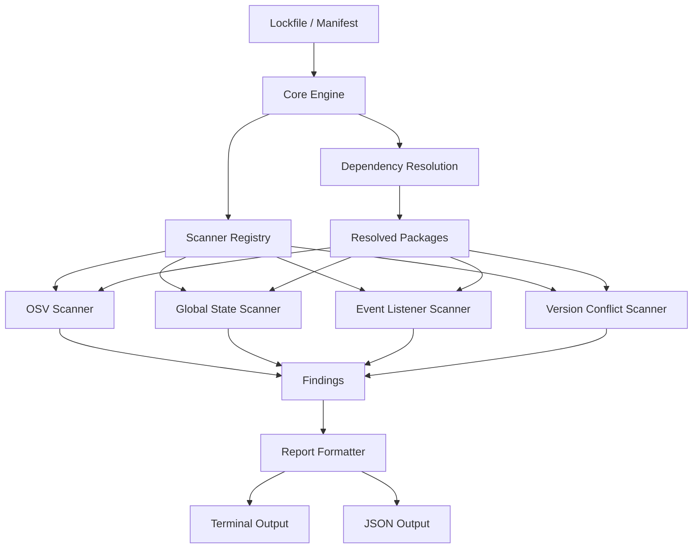
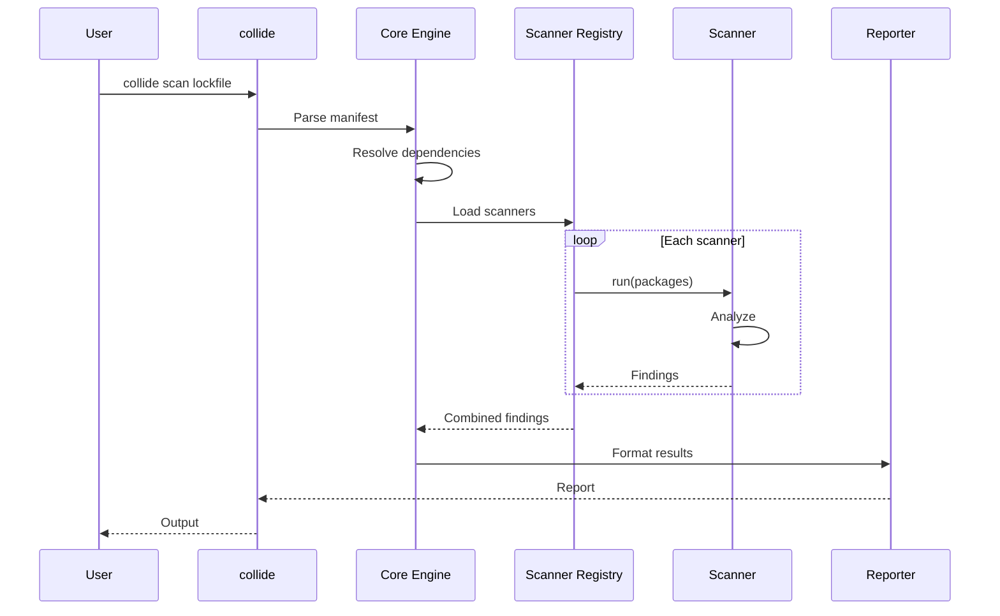
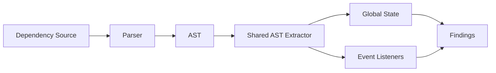
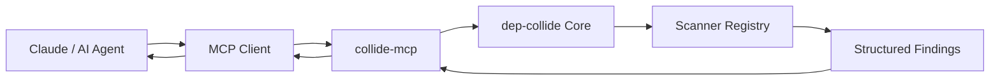
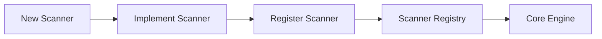

# dep-collide


### Dependency collision and vulnerability scanner for modern software projects

[](https://www.npmjs.com/package/dep-collide)
[](https://nodejs.org/)
[](LICENSE)

`dep-collide` analyzes project dependencies for **known vulnerabilities, dependency collisions, global state mutations, event listener registrations, and version conflicts**.

It provides a single scanning engine with pluggable ecosystem support for:

**npm · Go · Python · Rust · PHP**

Available as both a CLI and an MCP server, allowing developers and AI agents to run dependency analysis programmatically.

---

## Why dep-collide?

Traditional dependency scanners primarily answer:

> "Does this package have a known vulnerability?"

`dep-collide` also analyzes how dependencies can **interact with each other at runtime**.

Two individually valid dependencies can still introduce problems when they:

* Modify shared global state
* Mutate JavaScript prototypes
* Register process-wide event listeners
* Resolve to multiple versions
* Interact through shared runtime behavior

The goal is to identify **dependency interaction risks**, not only known CVEs.

---

## Features

| Capability | Description |
| --- | --- |
| Vulnerability scanning | Query known vulnerabilities through OSV |
| Global state analysis | Detect global and prototype mutations |
| Event listener analysis | Detect event listener registrations |
| Version conflict detection | Identify multiple resolved versions |
| Multi-ecosystem | npm, Go, Python, Rust, PHP |
| Shared scanner interface | Consistent architecture across ecosystems |
| JSON output | Machine-readable findings for automation |
| MCP server | Expose dependency scanning to AI agents |
| AST analysis | Source-level analysis for supported ecosystems |
| SQLite cache | Cache extracted dependency profiles |

---

## Installation

### Run without installing

```bash
npx -p dep-collide collide scan ./package-lock.json
````

### Install globally

```bash
npm install -g dep-collide
```

Then:

```bash
collide scan ./package-lock.json
```

Requires **Node.js 18 or newer**.

The package provides two executables:

```text
collide
collide-mcp
```

---

## Quick Start

Scan a project:

```bash
collide scan ./package-lock.json
```

Run selected scanners:

```bash
collide scan ./package-lock.json \
  --only=osv,global-state
```

Generate machine-readable JSON:

```bash
collide scan ./package-lock.json \
  --format=json
```

JSON output is designed for CI pipelines, automation, MCP clients, and other developer tools.

---

## Architecture

The scanner is built around a common `Scanner` interface.



The core engine is independent of individual scanners.

Adding a scanner does not require changing the core scanning logic.

---

## Scanner Pipeline



---

# Scanners

## OSV

Queries the [OSV database](https://osv.dev/) for known vulnerabilities affecting resolved dependencies.

```text
Manifest
   |
   v
Resolved packages
   |
   v
OSV query
   |
   v
Vulnerability findings
```

---

## Global State

Analyzes dependency source code for global and prototype mutations.

Examples:

```javascript
global.foo = value
globalThis.foo = value
Object.prototype.foo = value
Array.prototype.foo = value
```

For npm, this uses AST-based source analysis.

---

## Event Listeners

Detects dependency code that registers event listeners.

Examples:

```javascript
process.on(...)
process.addListener(...)
emitter.on(...)
emitter.addListener(...)
```

This can help identify packages that introduce process-wide or shared event handling behavior.

---

## Version Conflict

Analyzes the dependency graph and lockfile to identify multiple resolved versions of the same package.

Example:

```text
application
├── package-a
│   └── lodash@4.17.21
│
└── package-b
    └── lodash@4.17.15
```

Result:

```text
lodash
├── 4.17.21
└── 4.17.15
```

---

# AST Analysis

For npm, AST-based scanners share a single extraction pass.



This avoids independently traversing the same source files for every AST-based scanner.

Extracted profiles can also be persisted through the SQLite cache.

---

# Supported Ecosystems

The ecosystem is determined from the manifest or lockfile supplied to the CLI.

| Ecosystem | Manifest / Lockfile                               | Source Analysis                  |
| --------- | ------------------------------------------------- | -------------------------------- |
| npm       | `package-lock.json`                               | AST analysis over `node_modules` |
| Go        | `go.sum`, `go.mod`                                | Module cache heuristics          |
| Python    | `requirements.txt`, `poetry.lock`, `Pipfile.lock` | `site-packages` heuristics       |
| Rust      | `Cargo.lock`                                      | Cargo registry heuristics        |
| PHP       | `composer.lock`                                   | `vendor/` source analysis        |

### npm

```bash
collide scan ./package-lock.json
```

Source:

```text
node_modules/
```

### Go

```bash
collide scan ./go.sum
```

Source:

```text
$GOMODCACHE
```

### Python

```bash
collide scan ./requirements.txt
```

Source:

```text
.venv/
venv/
site-packages/
```

For Python, `osv` and `version-conflict` can operate from the manifest alone.

The collision scanners additionally inspect installed source when a discoverable virtual environment is available.

See [`docs/ecosystems/python-pip.md`](./docs/ecosystems/python-pip.md).

### Rust

```bash
collide scan ./Cargo.lock
```

Source:

```text
~/.cargo/registry/src
```

A custom source directory can be supplied through:

```text
$COLLIDE_CARGO_SRC
```

### PHP

```bash
collide scan ./composer.lock
```

Source:

```text
vendor/<vendor>/<package>/
```

---

# Output

Human-readable output:

```bash
collide scan ./package-lock.json
```

Machine-readable output:

```bash
collide scan ./package-lock.json --format=json
```

Example JSON:

```json
{
  "ecosystem": "npm",
  "packageCount": 184,
  "severity": {
    "critical": 0,
    "high": 2,
    "medium": 5,
    "low": 3
  },
  "findings": []
}
```

The shared finding structure is defined in:

```text
src/core/types.ts
```

---

# MCP Integration

`dep-collide` includes an MCP server that exposes dependency scanning as a tool for AI agents.



The MCP server exposes:

```text
scan_dependencies
```

This allows an AI agent to request a dependency scan and receive structured findings instead of parsing terminal output.

---

## Claude Desktop

Add `dep-collide` to your MCP configuration:

```json
{
  "mcpServers": {
    "collide": {
      "command": "npx",
      "args": [
        "-y",
        "-p",
        "dep-collide",
        "collide-mcp"
      ]
    }
  }
}
```

## Claude Code

```bash
claude mcp add collide -- \
  npx -y -p dep-collide collide-mcp
```

Then ask:

```text
Scan my dependencies at ./package-lock.json
```

The agent receives structured information including:

```text
ecosystem
package count
severity counts
scanner results
individual findings
```

---

# Project Structure

```text
src/
├── cli.ts
│
├── core/
│   ├── lockfile.ts
│   ├── scanner.ts
│   └── types.ts
│
├── scanners/
│   ├── shared-ast-extractor.ts
│   ├── util.ts
│   ├── osv.ts
│   ├── global-state.ts
│   ├── event-listeners.ts
│   └── version-conflict.ts
│
├── cache/
│   └── db.ts
│
└── report/
    └── format.ts
```

### Core

Responsible for dependency resolution, scanner orchestration, and shared types.

### Scanners

Independent implementations of the common `Scanner` interface.

### Cache

SQLite-backed cache for reusable AST profiles.

### Report

Formats findings for terminal and machine-readable output.

---

# Extending dep-collide

Scanners are intentionally modular.

To add a scanner:

```text
1. Create src/scanners/<name>.ts
2. Implement Scanner
3. Export the scanner
4. Register it in src/cli.ts
```



The core engine does not need to be rewritten for each new scanner.

---

# Development

Install dependencies:

```bash
npm install
```

Run the CLI directly through `tsx`:

```bash
npm run dev -- scan ./package-lock.json
```

Build:

```bash
npm run build
```

Run the compiled version:

```bash
npm start -- scan ./package-lock.json
```

---

# Design Principles

### One Core Engine

All ecosystems use the same scanning architecture.

### Pluggable Scanners

Individual checks remain isolated from the core.

### Static Analysis

Source-based collision detection does not require executing dependency code.

### Machine Readable

Structured JSON makes findings suitable for automation and CI pipelines.

### Agent Ready

MCP support allows dependency analysis to become part of AI-assisted development workflows.

---

# Project Status

> **Early development**

The core architecture, scanner interface, CLI wiring, reporting, ecosystem detection, and MCP integration are in place.

Active implementation areas include:

* Lockfile parsing
* AST extraction
* OSV queries
* SQLite caching
* Ecosystem-specific source discovery
* Scanner implementations

See [`design.md`](./design.md) for the complete technical design.

---

# Contributing

Contributions are welcome.

Before submitting a pull request:

```bash
npm install
npm run build
```

For architectural changes, please refer to [`design.md`](./design.md) first.

---

# License

MIT. See [`LICENSE`](./LICENSE).

